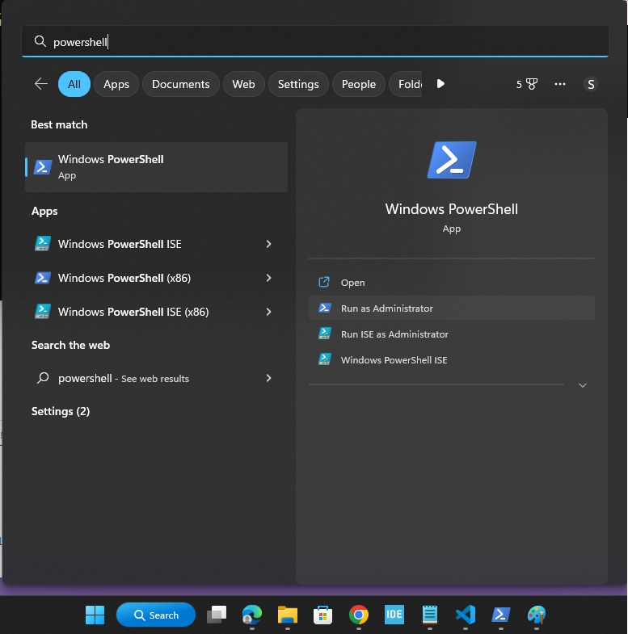
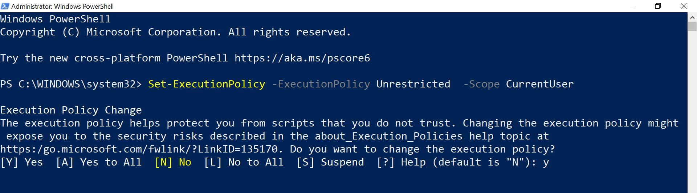
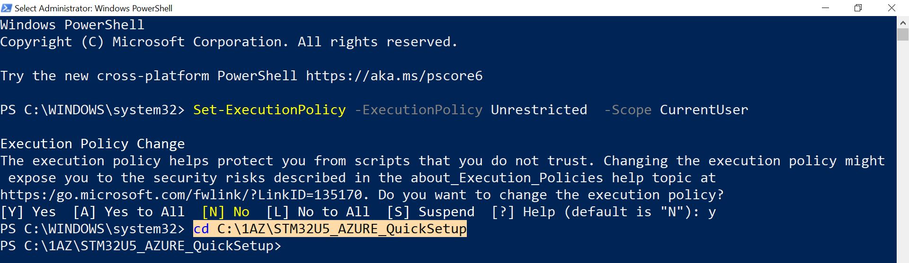
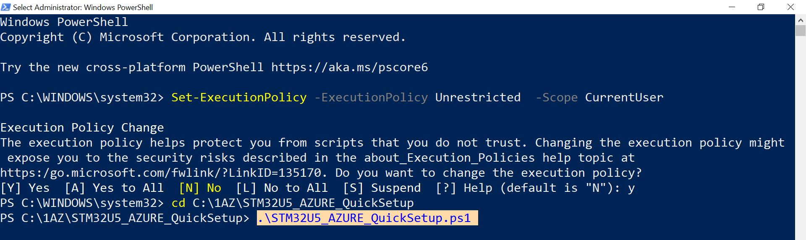
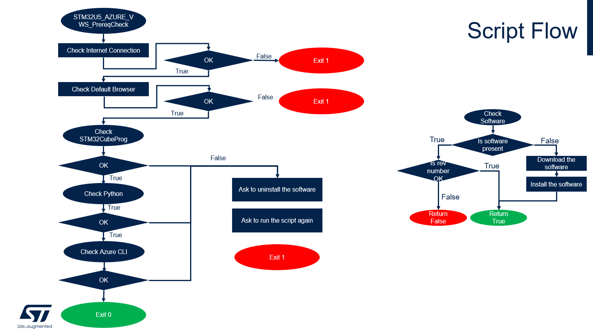
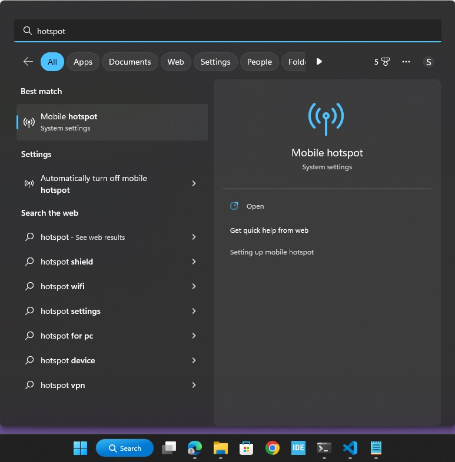
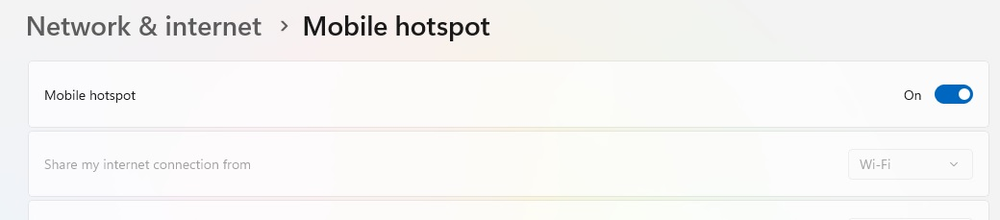
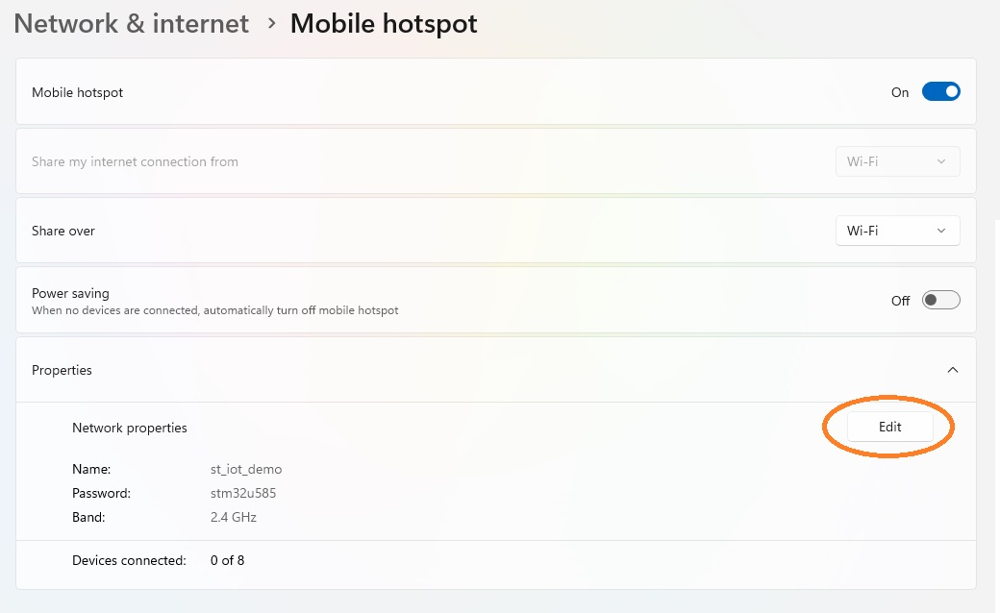
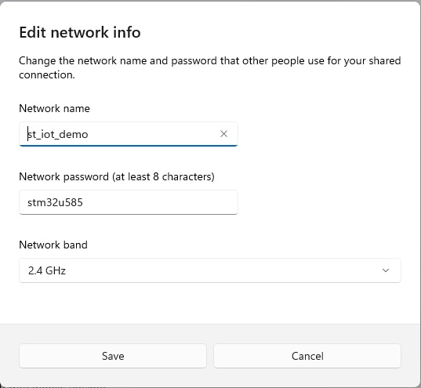
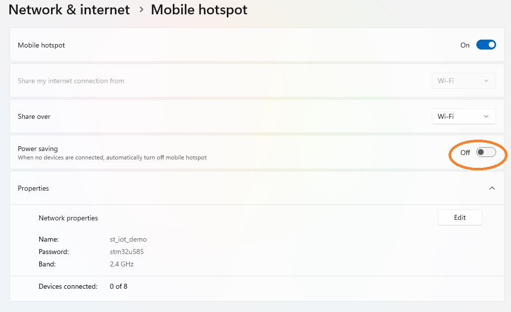

# STM32U5 Azure Virtual Workshop 2023

## 1- Introduction
Welcome to the STM32U5 Azure Virtual workshop.
To ensure that everything runs smoothly on the day of the workshop, it is recommended that you follow all installation steps before the workshop, ideally a week in advance.

This process may take between 15mn to 1 hours to complete depending on your system and Internet speed.

If you have any question or need support ahead of the workshop, please contact our support line. The details are provided at the end of this document.

## 2- Important
You need to have administration rights on your PC to be able to install drivers and software and to do the workshop.

## 3- System requirements
* Windows machine with admin rights
* USB port access
* RECCOMENDED: Fresh Windows install, Windows sandbox, or Windows running on a virtual machine

## 4- Hardware Requirements
* 1 x [B-U585I-IOT02A](https://www.st.com/en/evaluation-tools/b-u585i-iot02a.html) board
* 1 x male Type-A to male Type-B micro-USB cable (not included in the kit)
* Windows PC
* 2.4 GHz Wi-Fi router (No captive portal)

## 5- Minimum Recommended Hardware Requirements for PC
* Type A USB port
* 2+ GHz processor
* 4 GB of system memory (RAM)
* 10 GB of available disk space

Note: For machines with USB Type C, please have a Type A to Type C adapter

## 6- Software Requirements
You need a Windows PC with administration rights to be able to install drivers and software and to do the workshop. 

We recommend a fresh Windows install, if that is not possible, try to run Windows sandbox or a virtual machine. It will be hard for us to debug system issues remotely.

| Software                | Version   | Description                                                            |
| ----------------------- | --------- |----------------------------------------------------------------------- |
| Git                     |           | DevOps tool used for source code management                               |
| STM32CubeProgrammer     | 2.12.0    | All-in-one multi-OS software tool for programming STM32                                    |
| X-CUBE-AZURE            | 2.1.0     | Integrate modular Azure RTOS kernel and libraries with hardware enforced security to build more secure cloud connected applications |
| Python with Pip         | 3.11.1    | A general-purpose programming language                                 |
| Azure CLI               | 2.40.0    | A tool that pulls all the Azure services together in one central command line interface |
| Edge or Chrome          |           | Web browser                                                            |
| WebEx Application       |           | Video Conference tool used for specific questions on the day of the session |


## 7- Prepare your system
To ensure that everything runs smoothly on the day of the workshop, it is recommended that you follow all installation steps before the workshop, ideally a week+ in advance. The procedure depends on the operating system and could take between 15mn to 1h to complete. 

The instructions on setting up your Windows machine are described in this video.

The instructions below are the same as in the video.

### 7.1- Install Git

Download Git for your platform from the [official website](https://git-scm.com/downloads)

### 7.2- Clone the workshop repo
```
git clone https://github.com/AlnurElberier/STM32U5_AZURE_Virtual_Workshop_2023.git
```

### 7.3- Configure **PowerShell**

* Open PowerShell terminal as Administrator




* Set execution policy

Run the following command to allow script execution

```
Set-ExecutionPolicy -ExecutionPolicy Unrestricted  -Scope CurrentUser
```



Enter **y** to accept the Execution Policy Change

### 7.4- Navigate to the workshop directory

Navigate to the directory where you have cloned this repo to. 
```
cd C:\<Your directory>\STM32U5_AWS_Virtual_Workshop_2023
```




### 7.5- Execute the script

Type .\STM32U5_AZURE_VWS_PrereqCheck.ps1 to run the prerequisite check script

```
.\STM32U5_Azure_VWS_PrereqCheck.ps1
```



### 7.6 Script flow
STM32U5_AZURE_VWS_PrereqCheck programmatically installs all the software requirements to ensure that your environment is prepared for the workshop.

The flow is detailed here:



## 8- Wi-Fi Setup
You need a 2.4 GHz Wi-Fi to run the workshop as the Wi-Fi module on the  [B-U585I-IOT02A](https://www.st.com/en/evaluation-tools/b-u585i-iot02a.html) board supports 2.4 GHz Wi-Fi only. If you are not sure about yout Wi-Fi settings, you can setup your PC as a 2.4 GHz hotspot and connect the board to it. To do that:
* On the search bar type hotspot 
* Enable the hotspot 
* Edit the hotspot properties 
* Set the hotspot SSID, Password and Select the 2.4 GHz option  and click save 
* Trun the power saving option off 


## 9- Support

Questions and support ahead of the workshop

-	If you have issues during the software download and install, please contact ST by entering an Online Support Request at: https://community.st.com/s/onlinesupport?o=ws&tabset-08cae=2 
to help resolve the issue.

-	When entering the support request, in the Subject field please fill with: “STM32U5 AWS Virtual workshop”.

To ensure your request is quickly routed to the correct support team, please indicate the Workshop Request Type, Technical or Non-Technical, that best describes your question.
